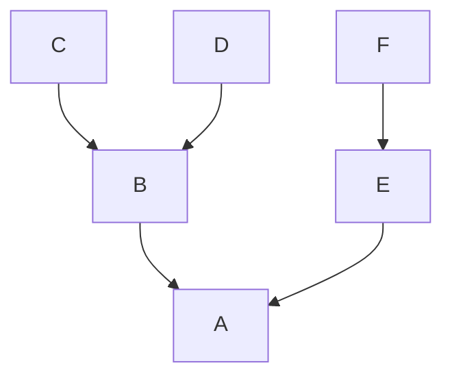
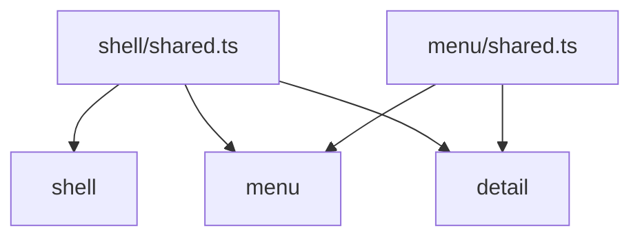
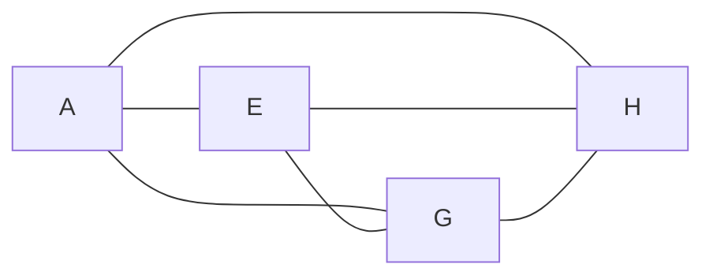

# Why use import-boundary

Inside one package, folder-to-folder imports are usually unrestricted—peers, skip-levels, and ancestor modules stay open unless you enforce them. This plugin turns **directory nesting** into an ESLint rule so dependency edges stay predictable at lint time.

By default only a parent may import a direct child’s [public entry](public-entry-files.md) (`index`). Sibling trees (features, `app`, `pages`, …) stay closed until you list them in `rootFiles`—for that layout, `rootFiles` is not an optional extra; it is how those peers connect. Use `sharedFiles` for shared logic under an owning folder.

## Predictable flow inside one root

`rootFiles` treats each listed path as a tree. Imports under that tree follow nesting—parent folders depend on their direct children.

```js
{
  rootFiles: ["src/A"],
}
```

```text
src/A/
├── B/
│   ├── C/
│   └── D/
└── E/
    └── F/
```



See [`rootFiles`](root-files.md) and [Default boundaries](default-boundaries.md).

## Shared logic under an owner

`sharedFiles` marks common code. Each shared file may provide logic to anything **under its owning folder**.

```js
{
  sharedFiles: ["**/shared.ts"],
}
```

```text
shell/
├── shared.ts
└── menu/
    ├── shared.ts
    └── detail/
```



See [`sharedFiles`](shared-files.md).

## Roots may depend on each other

`rootFiles` lets separate trees depend on each other’s public surface.

```js
{
  rootFiles: [
    "src/A",
    "src/E",
    "src/G",
    "src/H",
  ],
}
```



Object entries can restrict edges with [`allowedDependencies`](allowed-dependencies.md) (one-way). Use [`allowFreeInternal`](allow-free-internal.md) when a root should keep a free internal layout.

## Next steps

1. [Quick start](quick-start.md) — install and minimal config
2. [`rootFiles`](root-files.md) — choose roots and cross-root edges
3. [`allowedDependencies`](allowed-dependencies.md) / [`allowFreeInternal`](allow-free-internal.md) — object-entry options
4. [`extractDirectChildDirs`](extract-direct-child-dirs.md) — list feature folders for `rootFiles`
5. [`sharedFiles`](shared-files.md) — shared logic inside one tree
6. [`publicEntryFiles`](public-entry-files.md) — folder public entry basename
7. [Default boundaries](default-boundaries.md) — what is allowed or denied by default
