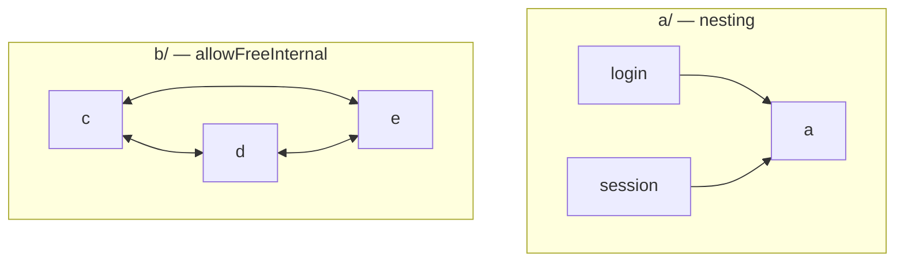
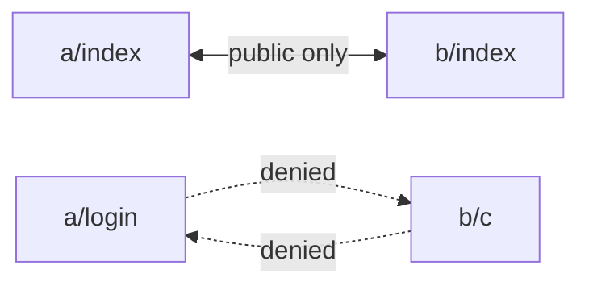

# Option: `allowFreeInternal`

`allowFreeInternal` is a boolean field on a **`rootFiles` object entry**. Modules under that root may import each other freely, while the outside world still sees only its public entry.

Use it when that root follows its own architecture instead of this plugin’s nesting model. Cross-root rules stay the same—public entries only. See [`rootFiles`](root-files.md) and [Default boundaries](default-boundaries.md).

## Configuration

```js
{
  rootFiles: [
    {
      path: "src/features/a",
      allowedDependencies: ["src/features/b"],
    },
    {
      path: "src/features/b",
      allowFreeInternal: true,
      allowedDependencies: ["src/features/a"],
    },
  ],
}
```

```text
src/features/a/          # nesting rules (default)
├── login/
└── session/

src/features/b/          # allowFreeInternal
├── c/
│   └── e/
└── d/
```

`allowFreeInternal` applies only to object entries. Combine it with [`allowedDependencies`](allowed-dependencies.md) when you need outbound cross-root edges (string entries never auto-connect to object entries).

## Inside: default vs free



- Under `a/`: `login` and `session` stay peers—sibling imports are denied.
- Under `b/`: `c`, `d`, and `e` may import each other (including skip-level, upward, and non-public files).

## Outside: public entry only



## Allowed

```ts
// Under b/ (allowFreeInternal) — siblings / nested peers
import { D } from "../d"; // OK — from b/c
import { D } from "../../d"; // OK — from b/c/e
import { B } from ".."; // OK — upward inside free root
import { x } from "../d/internal"; // OK — non-public file inside free root

// Cross-root — public entries only (same as without allowFreeInternal)
import { A } from "../../a"; // OK — from b/c → a’s public entry
import { B } from "../../b"; // OK — from a/login → b’s public entry
```

## Forbidden

```ts
// Under a/ (no allowFreeInternal) — siblings still denied
import { Session } from "../session"; // notAllowedTarget — from a/login

// Cross-root internals still denied
import { x } from "../../a/login"; // notAllowedTarget — from b/c
import { x } from "../../b/c"; // notAllowedTarget — from a/login
```

## Related

- Tree roots and string cliques: [`rootFiles`](root-files.md)
- One-way cross-root edges: [`allowedDependencies`](allowed-dependencies.md)
- Default allow/deny: [Default boundaries](default-boundaries.md)
