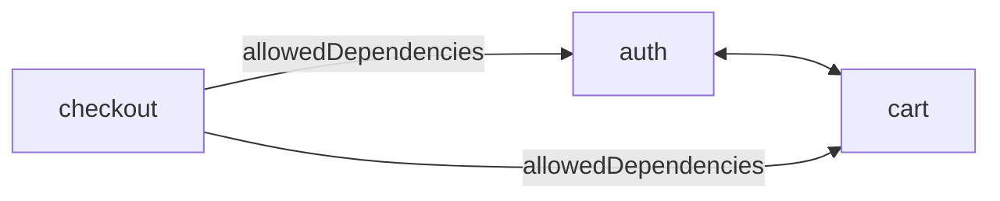

# Option: `allowedDependencies`

`allowedDependencies` is a field on a **`rootFiles` object entry**. Use it when one root should depend on others **one way**. `path` is the same directory path form as a string `rootFiles` entry; `allowedDependencies` lists other roots’ paths whose [`publicEntryFiles`](public-entry-files.md) this root may import.

For the basics of listing roots and bidirectional string cliques, see [`rootFiles`](root-files.md).

## Configuration

```js
{
  rootFiles: [
    "src/features/auth",
    "src/features/cart",
    {
      path: "src/features/checkout",
      allowedDependencies: [
        "src/features/auth",
        "src/features/cart",
      ],
    },
  ],
}
```



- `checkout → auth` and `checkout → cart` are allowed (public entries only).
- `auth ↔ cart` stay bidirectional because both are strings.
- `auth → checkout` and `cart → checkout` stay denied.

## Edge rules

Omit `allowedDependencies` (or pass `[]`) to register a root with **no** outbound cross-root edges.

String entries never auto-connect to object entries—list the reverse edge explicitly if you need it:

```js
{
  rootFiles: [
    {
      path: "src/features/a",
      allowedDependencies: ["src/features/b"],
    },
    {
      path: "src/features/b",
      allowedDependencies: ["src/features/a"],
    },
  ],
}
```

Cross-root imports still target **public entries only**—not internals under the other root. See [Default boundaries](default-boundaries.md).

## Allowed

```ts
// checkout → auth’s public entry
import { Auth } from "../auth"; // OK

// checkout → cart’s public entry
import { Cart } from "../cart"; // OK
```

## Forbidden

```ts
// auth → checkout (no reverse edge)
import { Checkout } from "../checkout"; // notAllowedTarget

// Into another root’s internals
import { x } from "../auth/login"; // notAllowedTarget
```

## Related

- Tree roots and string cliques: [`rootFiles`](root-files.md)
- Free internals under one root: [`allowFreeInternal`](allow-free-internal.md)
- Default allow/deny: [Default boundaries](default-boundaries.md)
