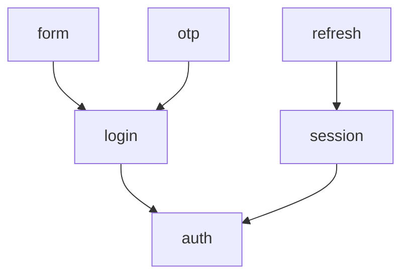
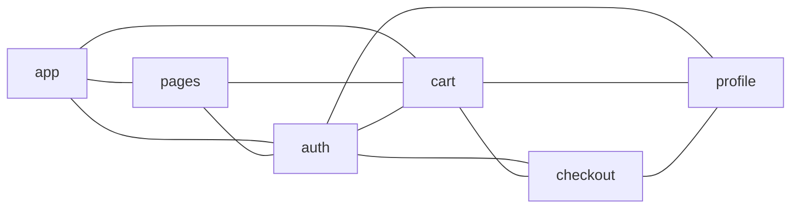

# Option: `rootFiles`

Use `rootFiles` when separate directory trees should depend on each other through each tree’s public surface (its [`publicEntryFiles`](public-entry-files.md) entry, default `index`). Without it, peer folders cannot import each other—so for a typical `app` / `pages` / `features/*` layout you list **every** tree that should expose a public entry, not only the feature folders.

Each entry is a **directory path** (for example `src/features/auth`). That path is a **tree root**. Listed roots may import **another root’s public entry** only—not internals, and not sibling folders under the same root. String entries connect to each other in both directions.

## Flow inside one root

Each `rootFiles` entry is one tree. Imports under it follow nesting—parent folders depend on their direct children.

```js
{
  rootFiles: ["src/features/auth"],
}
```

```text
src/features/auth/
├── login/
│   ├── form/
│   └── otp/
└── session/
    └── refresh/
```



Within that tree, the default rules still apply (parent → direct child public entry; skip-level, upward, and same-root siblings stay denied).

## Roots referencing each other

List each tree you want to connect—including composers like `app` / `pages` if they import features. Internals are not part of this picture—only the roots.

```js
{
  rootFiles: [
    "src/app",
    "src/pages",
    "src/features/auth",
    "src/features/cart",
    "src/features/checkout",
    "src/features/profile",
  ],
}
```



Every pair among **string** entries may talk (bidirectional).

## Options

Object entries on `rootFiles` can set these fields:

| Option | Description | Values | Default |
|--------|-------------|--------|---------|
| [`allowedDependencies`](allowed-dependencies.md) | Other roots whose public entries this root may import (one-way). | `string[]` | no special behavior |
| [`allowFreeInternal`](allow-free-internal.md) | Allow any import among modules under this root; cross-root stays public-entry-only. | `boolean` | `false` |
## Utility

- **`extractDirectChildDirs`** — Helper that returns the immediate child directories of a path, so you can spread them into `rootFiles` instead of listing each folder by hand. For details, see [`extractDirectChildDirs`](extract-direct-child-dirs.md).

## Allowed

```ts
// Under auth → cart’s public entry
import { Cart } from "../../cart"; // OK

// auth → cart (root to other root)
import { Cart } from "../cart"; // OK

// Direct child under the same tree (always OK; not specific to rootFiles)
import { Login } from "./login"; // OK
```

## Forbidden

```ts
// Same-root siblings are NOT opened by rootFiles
import { Otp } from "../otp"; // notAllowedTarget — siblings under the same parent

// Into another root’s internals
import { x } from "../../cart/item"; // notAllowedTarget — only that root's public entry…

// Upward to the rootFiles root module as a general ancestor import
import { Auth } from ".."; // upwardImport — child modules may not import ancestors…
```

Without `rootFiles`, peer trees stay denied—so omit a root only when nothing outside that tree should import its public entry.
