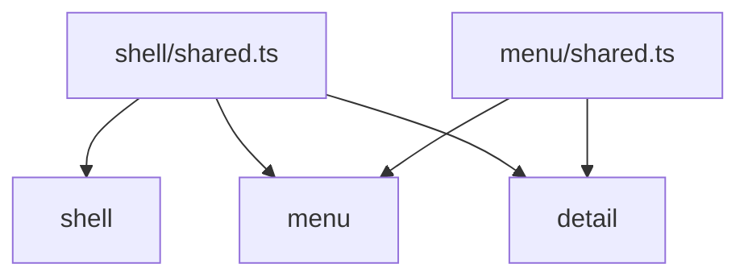

# Option: `sharedFiles`

Use `sharedFiles` for common logic **inside one owning folder**—helpers, types, a `shared` module—without opening every ancestor as a general import target. To wire separate trees together, use [`rootFiles`](root-files.md) instead.

Each match has an **owning folder** (the parent of the shared entry). Any file **under that owner** may import the shared resource—including what would otherwise be an upward import.

## How far shared reaches

`sharedFiles` marks common code. Each shared file may provide logic to anything **under its owning folder**.

```js
{
  sharedFiles: ["**/shared.ts"],
}
```

```text
shell/
├── shared.ts
└── menu/
    ├── shared.ts
    └── detail/
```



Files outside an owner cannot treat that owner’s shared file as theirs under this exception.

## Configuration patterns

```js
{
  sharedFiles: [
    "**/shared.ts",
    "**/shared.*.ts",
    "**/shared/**",
  ],
}
```

| Glob | Matches |
|------|---------|
| `**/foo.ts` / `**/foo.tsx` | A single shared file named `foo` |
| `**/foo.*.ts` / `**/foo.*.tsx` | Prefixed shared files (`foo.helpers.ts`, …) |
| `**/foo/**` | Everything under a shared folder `foo/` |

## Allowed

```ts
// shell/menu/menu.tsx
import { x } from "../shared"; // OK — under owner shell

// shell/menu/detail/detail.tsx
import { x } from "../../shared"; // OK — still under shell
import { y } from "../shared"; // OK — under owner menu
```

Shared folders:

```ts
// sharedFiles: ["**/foo/**"]
import { format } from "../foo/format"; // OK from under the owner
```

## Forbidden

Shared is not a free pass for unrelated edges. Skip-level, peer, and non-shared ancestor imports still follow [Default boundaries](default-boundaries.md).

```ts
// shell/menu/menu.tsx
import { Tabs } from "../tabs"; // notAllowedTarget — tabs is not shared

// shell/menu/detail/detail.tsx
import { Menu } from ".."; // upwardImport — ancestor module, not shared
```

## Related

- Cross-tree edges: [`rootFiles`](root-files.md)
- Default allow/deny: [Default boundaries](default-boundaries.md)
